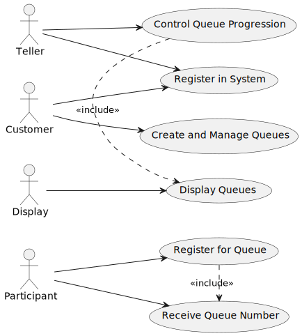
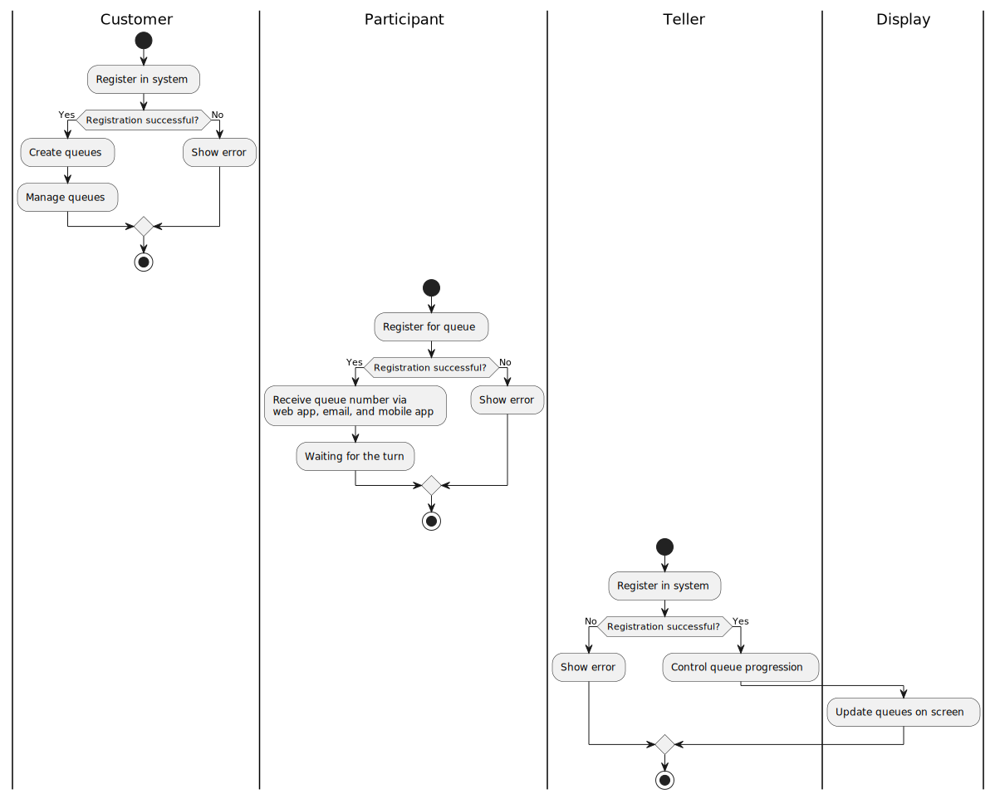
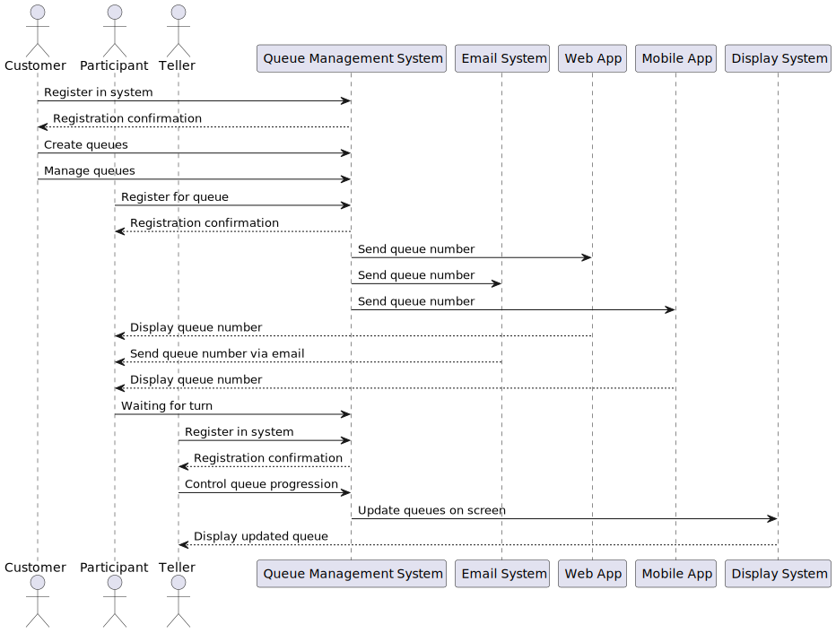
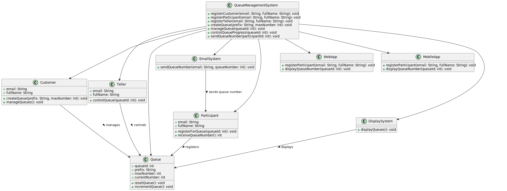
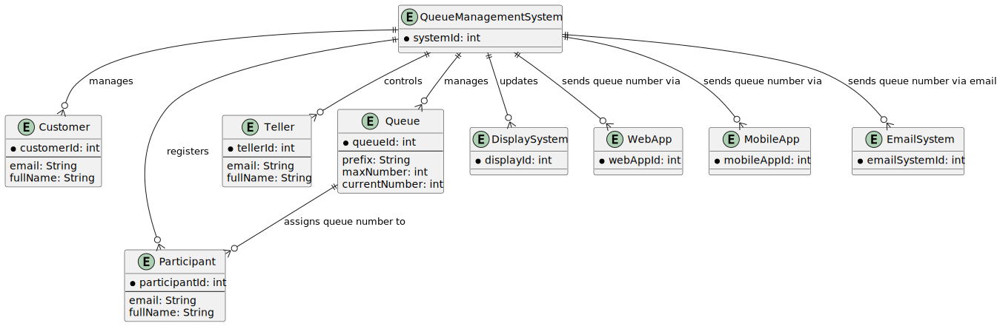

# User Story: Queue Management System

A customer must register in the system to create and manage queues. Each customer can have multiple queues, identified by a prefix and a maximum number. The queue numbering starts at the prefix followed by the number one, and increments until it reaches the maximum number. Once the maximum is reached, the numbering restarts from the beginning. Queues can also be manually reset.

Tellers must also register in the system to control queues. They use the app to confirm the progression of queue numbers. A display system shows multiple queues simultaneously and updates in real-time.

Participants can register for a queue online, either through a barcode scan or by entering a queue ID, using a web or mobile app. During registration, participants must provide their email and full name as identifiers for the teller when their turn is called or displayed. After registration, the participant receives their queue number, which is communicated via the web app, email, and mobile app notifications.

# Diagrams
## Usecase Diagram

## Activity Diagram

## Sequence Diagram

## Class Diagram

## Entity Diagram 

# Task
Create Queue Management System using Elixir and Phoenix Framework.